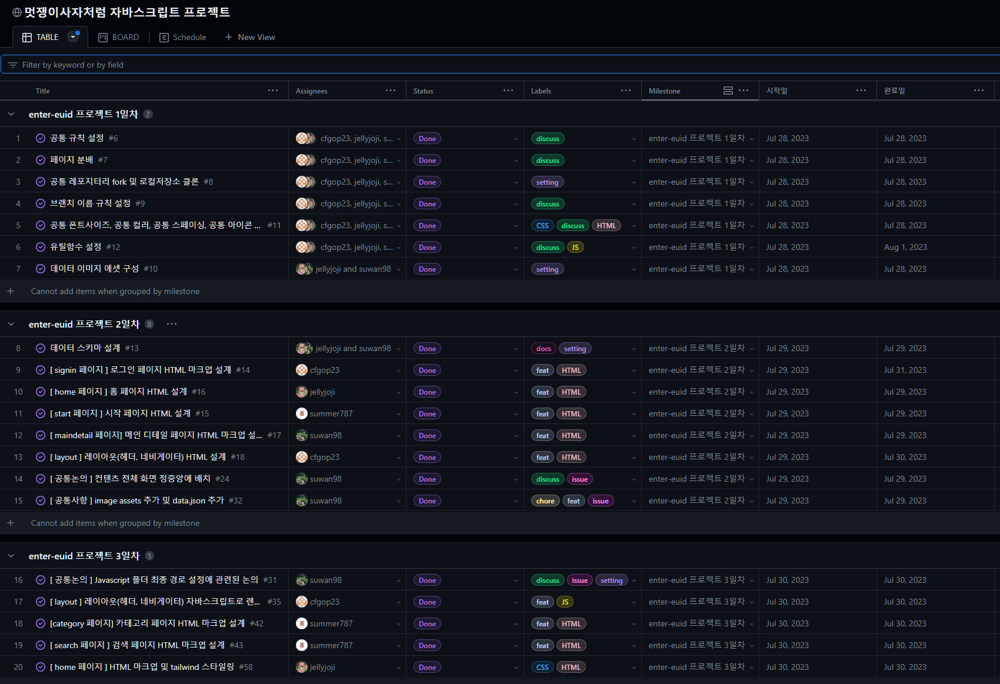

# 🦁 JS에서 9해조 - Enter EUID

**멋쟁이사자처럼 프론트엔드 스쿨 6기 html/css/Javascript Project - 9조**

## 🎈 프로젝트 목표

**검색엔진최적화(Search Engine Optimization)**

웹사이트와 웹페이지를 검색엔진이 쉽게 발견(디스커버리)하고, 읽어가서(크롤링), 색인하고(인덱싱), 상위 노출(랭킹)시켜 자연 유입되는 트래픽의 양과 질을 높일 수 있도록 관련 검색 알고리즘의 특성을 고려해서 웹사이트의 구조나 콘텐츠를 개선하는 작업을 하였습니다.

**브랜치(branch) 전략**

여러 명의 협업자가 Git의 브랜치(branch)를 사용하여 하나의 공동 저장소를 효율적으로 사용하기 위한 전략 (Work-Flow)을 사용하였습니다.
첫번째로 main 브랜치 생성후 develop 브랜치로 분리하여 각자의 작업 전용 브랜치를 파생하여 생성한 후 각자 각자 작업을 진행하고, 작업이 끝난 사람은 develop 브랜치에 자신의 브랜치의 변경 사항을 적용함으로써, 다른 사람의 작업에 영향을 받지 않고 독립적으로 특정 작업을 수행하여 그 결과를 하나로 모아 나가도록 하였습니다.

🗓️ 기간 : 2023년 7월 28일 ~ 2023년 8월 2일

## 💻 Git Commit Message 규칙 

`키워드 : 내용(#issueNumber)`

**Commit message Type**

- **feat** : 새로운 기능 추가, 기존의 기능을 요구 사항에 맞추어 수정
- **fix** : 기능에 대한 버그 수정
- **build** : 빌드 관련 수정
- **chore** : 패키지 매니저 수정, 그 외 기타 수정 ex) .gitignore
- **ci** : CI 관련 설정 수정
- **docs** : 문서(주석) 수정
- **style** : 코드 스타일, 포맷팅에 대한 수정
- **refactor** : 기능의 변화가 아닌 코드 리팩터링 ex) 변수 이름 변경
- **test** : 테스트 코드 추가/수정
- **release** : 버전 릴리즈

## 🌟 Commit message Rule

- 제목은 명령문으로, 과거형 ❌
- 제목 끝에 마침표 ❌
- 제목 첫 글자는 대문자
- : 앞과 뒤에 띄어쓰기하기
- 최대한 팀원들이 이해하기 쉽게 🥰

## ⚒️ Skills

## 💻 담당 기능

| 이름                   | 맡은 페이지                                          | 맡은 파트                                            |
| ---------------------- | ---------------------------------------------------- | ---------------------------------------------------- |
| 고수완 조장 🚀         | 메인디테일 페이지, 검색 페이지                       | 데이터스키마 설계 및 디테일 페이지 구성              |
| 차지훈 스크럼마스터 🚩 | 로그인페이지, 회원가입페이지, 검색페이지, 마이페이지 | 회원가입 페이지 와 로그인페이지 및 공통레이아웃 구성 |
| 조지현                 | 메인페이지                                           | 데이터스키마 설계 및 메인 페이지 구성                |
| 이송엽                 | 시작페이지, 카테고리페이지, 검색페이지               | 스타트 페이지,검색 페이지 및 카테고리 페이지 구성    |

### 🦁 고수완

- 데이터 스키마 설계 및 구현
- 디테일 페이지 마크업 및 스타일링
- 디테일 페이지 내 유저 정보 및 유저의 매너온도 비동기 통신으로 동적으로 렌더링
- 디테일 페이지 내 아이템 리스트 비동기 통신으로 동적으로 렌더링
- 메인페이지 에서 메인디테일 페이지로 넘어갈때 넘어오는 localstroage에서 - product-id값을 기반으로 렌더링
- 메인디테일 페이지 로딩 시 spinner 기능 구현
- swiper기능 구현
  - swiper 페이지네이션 불렛 커스텀 디자인
- json-server 데이터 내의 시간 정보를 기반으로 현재 시간과 비교해 업로드 시간 구현
- 검색 페이지 내 json-server의 데이터 기반으로 해당하는 데이터 검색 기능

### 🦁 차지훈

- 공통 레이아웃 제작 (헤더 및 하단 네비게이션) 및 해당 공통 레이아웃을 javascript로 동적으로 렌더링하는 기능 구현
- 로그인 페이지 내 로그인 기능 구현
- 회원가입 페이지 내 회원가입 기능 구현
- 가입 시 해당 휴대폰 번호 localSotrage에 id로 저장하는 기능 구현
- 인증 문자 받기 기능 구현
- 인증 문자 다시받기 타이머 기능 구현
- 마이페이지 내 회원탈퇴 기능
- 하단 네비게이터에서 현재 페이지가 해당 메뉴에 있을때 아이콘 색상 활성화 기능
- 검색 페이지 내 json-server의 데이터 기반으로 해당하는 데이터 검색 기능

### 🦁 조지현

- 데이터 스키마 설계 및 구현
- 메인페이지 마크업 및 스타일링
- swiper.js를 이용한 슬라이드 구현
- json-server data 기반으로 한 아이템 리스트 비동기 통신으로 동적 렌더링
- mainpage에서 detailmainpage로 넘어갈 때 클릭한 아이템의 product-id를 localStoarge에 저장
- 검색 페이지 내 json-server의 데이터 기반으로 해당하는 데이터 검색 기능
- 날짜와 시간 정보에 대한 유틸 함수 생성 및 리스트 업데이트 시간 데이터 적용

### 🦁 이송엽

- 시작페이지 및 카테고리 페이지, 검색 페이지 마크업 및 스타일링
- 카테고리 페이지 내에 버튼 클릭 시 클릭한 버튼의 background 및 해당 svg icon 동적으로 변경되도록 구현
- 해당 버튼을 눌렀을때 해당 아이템에 대한 정보가 localstorage로 저장되도록 구현
- 페이지 이동 기능 구현
- 검색 페이지 내 json-server의 데이터 기반으로 해당하는 데이터 검색 기능

## 👨🏼‍💻 git project 진행 상황

## 🌟 Project 구현

### 1. 시작 페이지

### 2. 카테고리 페이지

### 3. 회원가입 페이지

### 4. 로그인 페이지

### 5. 메인 페이지

### 6. 디테일 페이지

### 7.마이 페이지

## 🌟 배포 주소

Link: [wiki](https://github.com/like-lion-javascript-project-9/enter-euid/wiki)

Link: [깃헙 페이지](like-lion-javascript-project-9.github.io)

Link: [발표 자료](https://docs.google.com/presentation/d/1jyUphLjqV715_fXC8ClOXy9R_TRBCmVgsQYuDT_HrwU/edit?pli=1#slide=id.g25df12edd5c_4_15)
